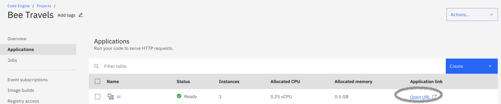

# Deploy an app to IBM Cloud Code Engine

This code pattern introduces you to [Code Engine](https://www.ibm.com/cloud/code-engine) and shows how to deploy an application to the managed serverless platform. The application used in this code pattern is a part of the [Bee Travels project](https://bee-travels.github.io/) that focuses on some of the first version services of the application. 

The services included in this code pattern are:

* Destination v1 (Node.js)

* UI (Node.js/React)

Below is the architecture diagram of the Bee Travels application:


# What is IBM Cloud Code Engine?

[IBM Cloud Code Engine](https://cloud.ibm.com/docs/codeengine?topic=codeengine-getting-started) is a new [Serverless compute service](https://www.developer.com/cloud/what-is-serverless-computing/) that lets developers run application containers, code, and batch jobs in a fully managed container runtime. It allows development teams to have all of their cloud-native needs even if they do not have cloud-native skills or knowledge. This lets the development team live the dream of [focusing on code](https://cloud.ibm.com/docs/codeengine?topic=codeengine-about#benefits) instead of managing headaches or cloud infrastructure issues.

In addition, Code Engine is integrated with [LogDNA](https://cloud.ibm.com/docs/log-analysis?topic=log-analysis-getting-started) to allow for logging of your applications. 

# Architecture

1. The Code Engine build feature clones the Github repo and builds the container images for the Bee Travels microservices in the repo based on the provided Dockerfiles.
2. The newly built container images get pushed to repos on the provided [image registry](https://cloud.ibm.com/docs/Registry?topic=Registry-getting-started) which in this case is IBM Cloud Container Registry.
3. Code Engine applications are created for the Bee Travels microservices from the newly built container images on IBM Cloud Container Registry.

# Steps

1. [Prerequisites](#1-prerequisites)
2. [Clone the repo](#2-clone-the-repo)
3. [Build and Deploy to Code Engine](#3-build-and-deploy-to-code-engine)

## 1. Prerequisites

To follow the steps in this code pattern, you need the following:

* [IBM Cloud account](https://cloud.ibm.com/registration)
* [IBM Cloud CLI](https://cloud.ibm.com/docs/cli?topic=cli-getting-started)

## 2. Clone the repo

   Clone the `codeenginetrysample` repo locally. In a terminal window, run:

   ```
   $ git clone https://github.com/testrashmi/codeenginetrysample
   $ cd codeenginetrysample
   ```

## 3. Build and Deploy to Code Engine

1. From a terminal window, login to your IBM Cloud account using the CLI command:

   `ibmcloud login --sso`

2. Verify you are targeting the correct region, account, resource group, org and space by running

   `ibmcloud target`
 
    To set any of these to new targets, add `-h` to the command to view the necessary flags for changing the targets 
    
    `ibmcloud target -h`
 
    Example:

   `ibmcloud target -g RESOURCE_GROUP`

   `ibmcloud target -g App`

3. Install the IBM Cloud Code Engine plug-in for the IBM Cloud CLI by running: 

   `ibmcloud plugin install code-engine`

4. Verify the plug-in is installed by running `ibmcloud plugin list` and seeing `code-engine[ce]` in the list of plug-ins.

   Enter  `ibmcloud ce help` for more information about Code-engine commands.

5. Create a project

   ```
   ibmcloud ce project create -n "Bee Travels"
   ```
    A [project](https://cloud.ibm.com/docs/codeengine?topic=codeengine-about#terminology) is a grouping of Code Engine entities such as applications, jobs, and 
    builds. A project is based on a Kubernetes namespace.

    To see list of projects in the targetted resource group 

    `ibmcloud ce project list`

    Navigate to:
    https://cloud.ibm.com/codeengine/projects .
    "Bee Travels" is listed .
    
    

6. To determine the unique ID of the Project:

    ```
    ibmcloud ce proj current |grep "Context:"|awk '{print $2}'
    ``` 
    It is responsible for getting the unique ID of the project. Each project has an associated unique ID that is used as part of the endpoints defined for the apps 
    within that project. This is needed for getting the URLs of applications for internal traffic to the project which will be shown later.

7.  Create Namespace in Container Registry:

    Navigate to https://cloud.ibm.com/registry/namespaces .

    Switch to a Location say Tokyo.

    Create a namespace say "cesample".

8. Add registry access to Code Engine.

    Navigate to https://cloud.ibm.com/iam/apikeys .

    Click create an IBM Cloud API key.

    Enter a name and optional description for your API key and click Create.

    Copy the API key or click download to save it.

    Example:

    Name: registryJP

    API key: CoDKpQraJN94KeF5bvx6d_Y9FWiW8sbKA49lcp9Il4Sw

9. Creating image registry access secret:

    ```
    ibmcloud ce registry create --n myregistryjp --s jp.icr.io --u iamapikey --p "CoDKpQraJN94KeF5bvx6d_Y9FWiW8sbKA49lcp9Il4Sw"
    ```

    * `-n` names the image registry access secret
    * `-u` specifies the username to access the registry server
    * `-p` specifies the password to access the registry server
    * `-s` is the URL of the registry server

    For Docker Hub, the server name is `https://index.docker.io/v1/` .

    For Container Registry, the server name is `region.icr.io` .

    

10. Lets try [building image](https://cloud.ibm.com/docs/Registry?topic=Registry-registry_images_&interface=ui#registry_images_source) using docker command.
 
     The docker build command builds Docker images from a Dockerfile.

     Switch to the directory 'src/services/ui' in the gitrepo codeenginetrysample.

     Then,

     ```
     docker build -t <image_name> <directory>
     ```
     example:

     `docker build -t ui .`

     To list docker images:

     `docker images`

     Then,

     `docker tag ui:latest jp.icr.io/cesample/ui:latest`

11. Log in to IBM Cloud Container Registry.
 
    `ibmcloud cr region-set jp.icr.io`

12. Perform docker image push to share your images to the registry.
 
    `docker push jp.icr.io/cesample/ui:latest`

13. To ensure the image is created:
 
    `ibmcloud cr images`

     The image created gets listed with location chosen as Tokyo.

     https://cloud.ibm.com/registry/images

14. Create a [build configuration](https://cloud.ibm.com/docs/codeengine?topic=codeengine-build-image#build-create-cli)

      ```
      ibmcloud ce build create --n "destination-v1-build" --src "https://github.com/testrashmi/codeenginetrysample" --i "jp.icr.io/cesample/destination" --rs myregistryjp --cdr src/services/destination-v1 --sz small
      ```

     It creates a build configuration that will turn the source code from Github into runnable container images for applications in Code Engine. 

     * `-n` names the build
     * `-i` points to where the built container image will be pushed to
     * `--src` points to the Github repo where the source code is
     * `--rs` the name of the image registry access secret to be used
     * `--cdr` specifies the directory in the Github repo where the Dockerfile to be used is
     * `--sz` specifies the size for the build which determines the amount of resources used. This is optional and the default value is `medium`.

15. Navigate to the project "Bee Travels" from https://cloud.ibm.com/codeengine/projects.
 
    

16. Creating a [build run](https://cloud.ibm.com/docs/codeengine?topic=codeengine-build-image#build-run-cli) from a repository:

     ```
     ibmcloud ce buildrun submit -b destination-v1-build -n destination-v1-buildrun -w
     ```

     It starts and runs the build configuration that was created on the previous line. 
     * `-b` the name of the build configuration to run the build
     * `-n` names the build run
     * `-w` waits for the build run to complete before moving on to the next line of the shell script. This is optional.

     

    [Troubleshooting tips](https://cloud.ibm.com/docs/codeengine?topic=codeengine-troubleshoot-build)

     `ibmcloud ce buildrun get -n destination-v1-buildrun` to check the build run status.

     `ibmcloud ce buildrun events -n destination-v1-buildrun` to get the system events of the build run.

     `ibmcloud ce buildrun logs -f -n destination-v1-buildrun` to follow the logs of the build run.

17. The image created can be found here:
 
     https://cloud.ibm.com/registry/images

     Click on the image and the image details are seen .

18. [Deploying your app](https://cloud.ibm.com/docs/codeengine?topic=codeengine-cli#cli-application-create) destination-v1  :
 
     ```
     ibmcloud ce app create -n "destination-v1" -i "jp.icr.io/cesample/destination" -cl -p 9001 --min 1 --cpu 0.25 -m 0.5G -e LOG_LEVEL=info --registry-secret
     myregistryjp
     ```

    **Output on terminal obtained is:**

    `destination-v1.iz7gckmh5qv.svc.cluster.local`

    This will be used as an environment variable for the next command that we execute.
    The command creates an application in our Code Engine project for our destination microservice. An application in Code Engine runs your code to serve HTTP 
    requests with the number of running instances automatically scaled up or down.
    
    Since the other microservices use internal traffic, Code Engine uses the format <APP_NAME>.<ID>.svc.cluster.local as the entrypoint to an application. 
   
    APP_NAME for each application is already defined in each ibmcloud ce app create command and ID was seen from one of the previous command.

     * `-n` names the application
     * `-i` points to the container image reference
     * `--cl` specifies that the application will only have a private endpoint and no exposure to external traffic. This can be used by backend services that do not
      need exposure to outside traffic and only communicate between other services of an application. By not exposing applications that don't need external 
      exposure,
      this may also save potential security risks
     * `-p` specifies the listening port. This only needs to be set when the port used by the application is not the default 8080
     * `--min` specifies the minimum number of instances of the application running. The default value is 0
     * `--cpu` specifies the amount of CPU resources for each instance
     * `-m` specifies the amount of memory resources for each instance
     * `-e` is used for each environment variable used by the application


   [Troubleshooting tips](https://cloud.ibm.com/docs/codeengine?topic=codeengine-troubleshoot-apps)

     Run `ibmcloud ce application get -n destination-v1` to check the application status.

     Run `ibmcloud ce application events -n destination-v1` to get the system events of the application instances.

     Run `ibmcloud ce application logs -f -n destination-v1` to follow the logs of the application instances.

19. Deploying your app ui  :

     ```
     ibmcloud ce app create -n "ui" -i "jp.icr.io/cesample/ui" -p 9000 --min 1 --cpu 0.25 -m 0.5G -e NODE_ENV=production -e DESTINATION_URL=http://destination-
     v1.iz7gckmh5qv.svc.cluster.local --registry-secret myregistryjp

     ```
     It creates an application in our Code Engine project for the UI microservice. This is the microservice that users will interact with and therefore requires 
     external traffic. 
   
     Notice how this command does not have the `--cl` flag. The removal of this flag allows for external traffic and a URL to be generated for the application. The 
     URL is secured automatically. In addition, some of the environment variables for this microservice specify the URLs to communicate with the other 
     microservices. 
   
     Since the other microservices use internal traffic, Code Engine uses the format `<APP_NAME>.<ID>.svc.cluster.local` as the entrypoint to an application. 
   
     `APP_NAME` for each application is already defined in each `ibmcloud ce app create` command and `ID` was seen from one of the previous command.

      

      

     Notice how the minimum number of instances for each application of Bee Travels is set to 1: `--min 1`. This is due to the fact that we want Bee Travels to 
     always be readily available for traffic without delay and needing an instance to be initialized via cold start.

     **Use cases** for using the default value of 0 for the mimimum number of instances for each application include:

     * Application does not receive a high volume of traffic consistently
     * Cold start delays are not a concern
     * Interested in conserving resources and costs
   
  20. IBM Cloud Load Generator Service:
   
      Open up a second window of your web browser side by side with the first window and go to https://load.fun.cloud.ibm.com to access the IBM load generator tool.
   
      For the URL to enter, copy/paste the `https://ui.<NAMESPACE>.<REGION>.codeengine.appdomain.cloud` URL that is used to access the Bee Travels application.
      You can also retrieve this URL from your first web browser URL by copying the URL from the Open Application URL button.
   
       
   
       
   
   21. Press the Generate Load button on the load generation tool and watch how the number of instances of the ui application auto-scale up to 10 while traffic is          being generated and back down to 1 once the traffic stops.
   
        
   
   ## Summary
   
     Congratulations, you just deployed the App successfully
     
   
     Launch the URL of the App
     

   ## References
 
    [Sitemap for Code Engine](https://cloud.ibm.com/docs/codeengine?topic=codeengine-sitemap)
 
    For more details and documentation on the Code Engine CLI, go [here](https://cloud.ibm.com/docs/codeengine?topic=codeengine-cli) .

